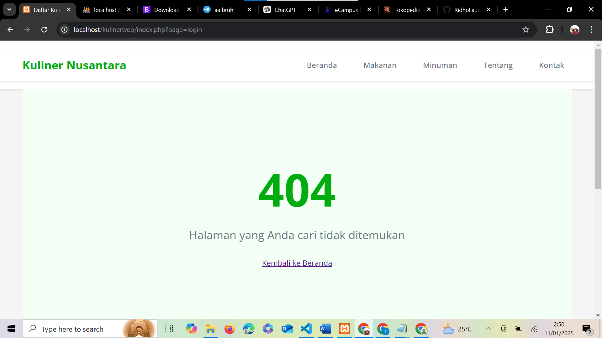
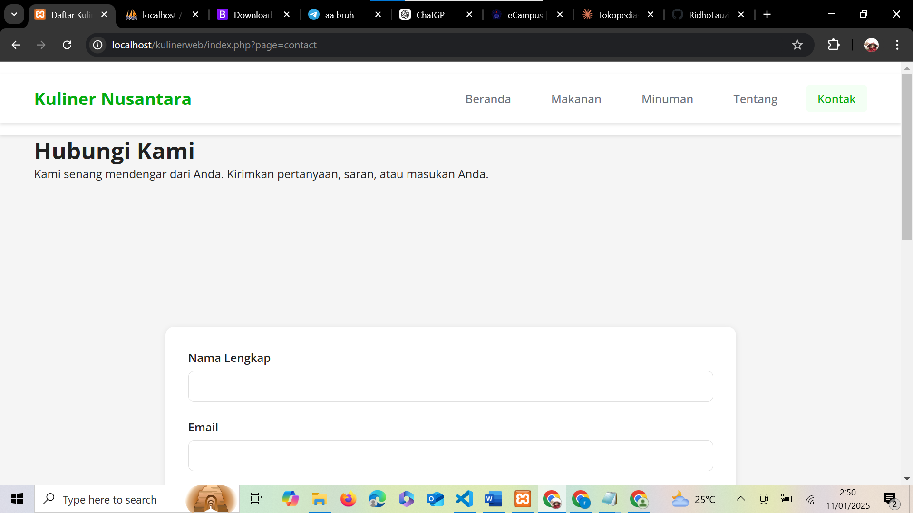
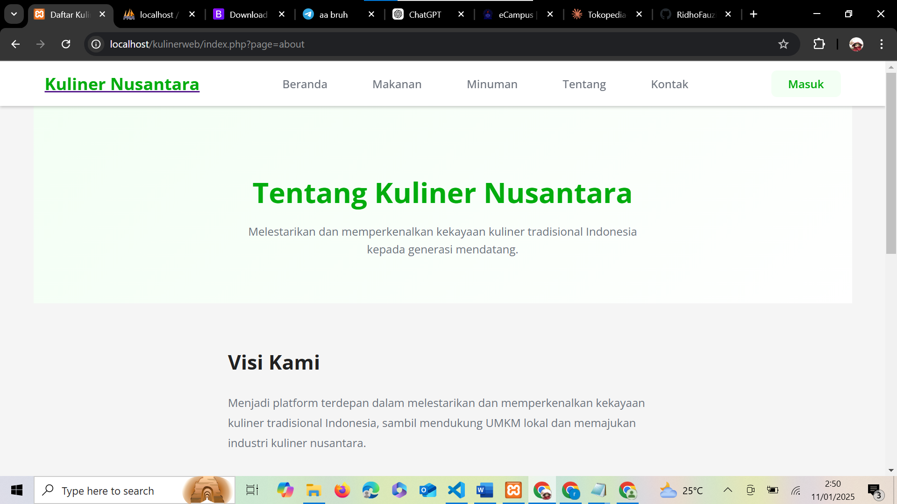
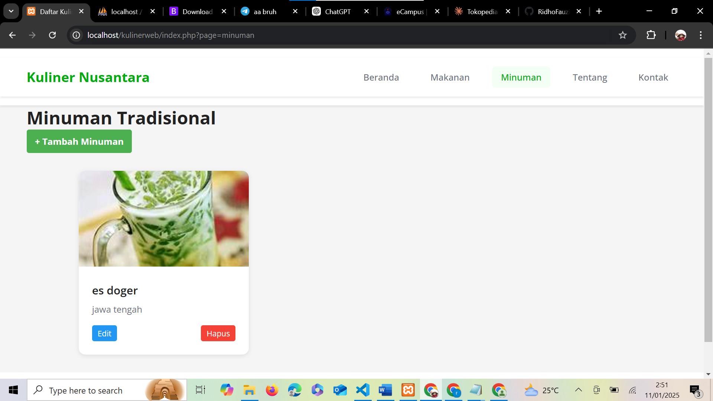
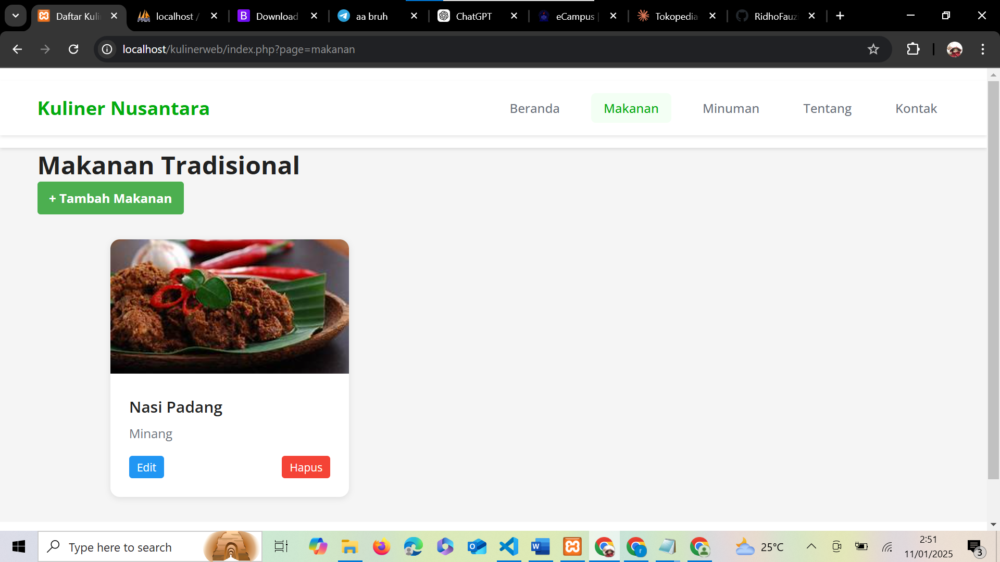
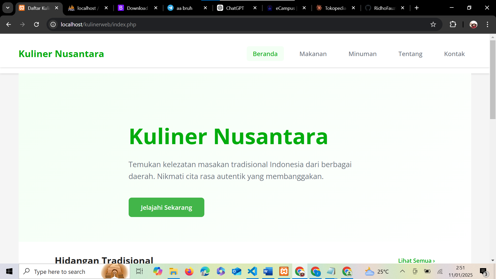

# Kuliner Nusantara Website Documentation

## Overview
Kuliner Nusantara is a web application dedicated to preserving and introducing traditional Indonesian culinary heritage to future generations. The platform showcases traditional foods and beverages from various regions of Indonesia.

## Pages and Features

### 1. Error Page (404)
!
- Custom 404 error page
- Shows "404" in large green text
- Displays "Halaman yang Anda cari tidak ditemukan" (The page you're looking for was not found)
- Includes a "Kembali ke Beranda" (Back to Home) link

### 2. Contact Page
!
- Features a "Hubungi Kami" (Contact Us) section
- Welcoming message: "Kami senang mendengar dari Anda. Kirimkan pertanyaan, saran, atau masukan Anda."
- Contact form with fields for:
  - Nama Lengkap (Full Name)
  - Email

### 3. About Page

- Contains "Tentang Kuliner Nusantara" (About Culiner Nusantara) section
- Mission statement: "Melestarikan dan memperkenalkan kekayaan kuliner tradisional Indonesia kepada generasi mendatang."
- Vision ("Visi Kami"):
  - Aims to be the leading platform in preserving and introducing traditional Indonesian culinary wealth
  - Supports local SMEs (UMKM)
  - Promotes the Indonesian culinary industry

### 4. Traditional Beverages Page

- Lists traditional Indonesian beverages
- Features "Minuman Tradisional" (Traditional Beverages) section
- Example entry: "Es Doger" from Central Java
- Includes "Tambah Minuman" (Add Beverage) button
- Each entry has Edit and Delete (Hapus) options

### 5. Traditional Foods Page

- Showcases traditional Indonesian dishes
- Features "Makanan Tradisional" (Traditional Foods) section
- Example entry: "Nasi Padang" from Minang region
- Includes "Tambah Makanan" (Add Food) button
- Each entry has Edit and Delete (Hapus) options

### 6. Home Page

- Features main heading "Kuliner Nusantara"
- Welcoming text: "Temukan kelezatan masakan tradisional Indonesia dari berbagai daerah. Nikmati cita rasa autentik yang membanggakan."
- "Jelajahi Sekarang" (Explore Now) button
- "Hidangan Tradisional" (Traditional Dishes) section
- Navigation menu including:
  - Beranda (Home)
  - Makanan (Food)
  - Minuman (Beverages)
  - Tentang (About)
  - Kontak (Contact)

## Navigation
The website features a consistent navigation bar across all pages with the following menu items:
- Beranda (Home)
- Makanan (Food)
- Minuman (Beverages)
- Tentang (About)
- Kontak (Contact)

## Technical Details
- Built using PHP
- Runs on localhost
- Uses a clean, modern interface with green as the primary accent color
- Responsive design for various screen sizes
- CRUD functionality for food and beverage items
